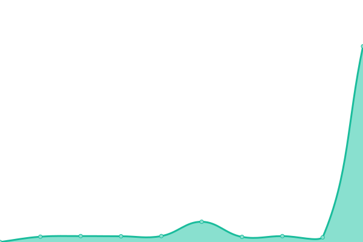

# [📈 Live Status](https://LunaLu-dev.github.io/Uptime-Monitor): <!--live status--> **🟧 Partial outage**

This repository contains the open-source uptime monitor and status page for [Luna Nordbergh](https://lunalu.org/socials/), powered by [Upptime](https://github.com/upptime/upptime).

With [Upptime](https://upptime.js.org), you can get your own unlimited and free uptime monitor and status page, powered entirely by a GitHub repository. We use [Issues](https://github.com/LunaLu-dev/Uptime-Monitor/issues) as incident reports, [Actions](https://github.com/LunaLu-dev/Uptime-Monitor/actions) as uptime monitors, and [Pages](https://LunaLu-dev.github.io/Uptime-Monitor) for the status page.

<!--start: status pages-->
<!-- This summary is generated by Upptime (https://github.com/upptime/upptime) -->
<!-- Do not edit this manually, your changes will be overwritten -->
<!-- prettier-ignore -->
| URL | Status | History | Response Time | Uptime |
| --- | ------ | ------- | ------------- | ------ |
|  [LunaLu.org](https://www.lunalu.org) | 🟩 Up | [luna-lu-org.yml](https://github.com/LunaLu-dev/Uptime-Monitor/commits/HEAD/history/luna-lu-org.yml) | 

 1109ms
     
 | 

<a href="https://LunaLu-dev.github.io/Uptime-Monitor/history/luna-lu-org">91.71%</a>
    

|  [NextCloud](https://nextcloud.lunalu.org) | 🟥 Down | [next-cloud.yml](https://github.com/LunaLu-dev/Uptime-Monitor/commits/HEAD/history/next-cloud.yml) | 

 2248ms
     
 | 

<a href="https://LunaLu-dev.github.io/Uptime-Monitor/history/next-cloud">45.20%</a>
    

<!--end: status pages-->

[**Visit our status website →**](https://LunaLu-dev.github.io/Uptime-Monitor)

## 📄 License

- Powered by: [Upptime](https://github.com/upptime/upptime)
- Code: [MIT](./LICENSE) © [Anand Chowdhary](https://anandchowdhary.com), supported by [Pabio](https://pabio.com)
- Data in the `./history` directory: [Open Database License](https://opendatacommons.org/licenses/odbl/1-0/)
